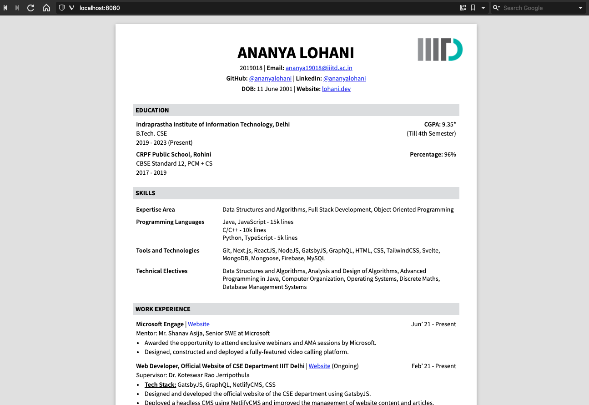

# IIIT Delhi Resume

A fully-customizable resume template in IIIT Delhi format made with basic HTML, CSS and JavaScript. I used this template for the on-campus internship placements in Summer 2021 and got an offer from Microsoft (Engage) and a full-time internship offer from Expedia.

I tried lots of ways to make a resume in this format - Google Docs, Pages, Canva - but none of them allowed me to fit all the information I wanted and still keep it within two pages. So, I decided to code it myself!

IIITD folks, feel free to customize and use this for yourself and get :clap: that :clap: bread :clap:.

## How To Use This Template

- The resume is generated completely from the data in [data.yaml](data.yaml). Populate the file with your information in the same format. Refer to [this guide for basic YAML syntax](https://www.tutorialspoint.com/yaml/yaml_basics.htm) in case you're unfamiliar.

- The styles can be edited according to your preference in [styles.css](styles.css). I've added the styles suited to the amount of information I wanted to display on my resume. You might have to tweak the styles according to your needs.

- The template skeleton is coded in HTML. Feel free to modify it however you want.

- Your resume should typically be a single page, but the IIITD format is a bit rigid so it's okay if your IIITD resume extends to two pages. Try not to make it beyond two pages though.

## Steps To Set Up

1. Clone this repository.

```bash
  git clone https://github.com/ananyalohani/iiitd-resume.git
  cd iiitd-resume
```

2. Install dependencies.

```bash
  npm install
```

3. Start the development server. The page will be served at http://localhost:8080.

```bash
  npm run serve
```

4. Edit the data in [data.yaml](data.yaml)

5. Refresh your webpage to see the changes. You might have to do a hard refresh (<kbd>Ctrl</kbd> + <kbd>Shift</kbd> + <kbd>R</kbd> or <kbd>⌘⇧R</kbd>). At this point the webpage looks like this:

   

6. Export the webpage to a text-readable PDF output file.
  - In `convertToPDF.js`, make changes if you have to, to the HTML page path (port change or a different route) and/or the name of your PDF output file.
  
  - Finally, run the JavaScript with the following command and your resume is generated in PDF.
  ```bash
    node convertToPDF.js
  ```

## Contact

If this template helped you, or if you have any queries, feel free to reach out to me on [Telegram](https://t.me/ananyalohani).

Created by [Ananya Lohani](https://lohani.dev).
